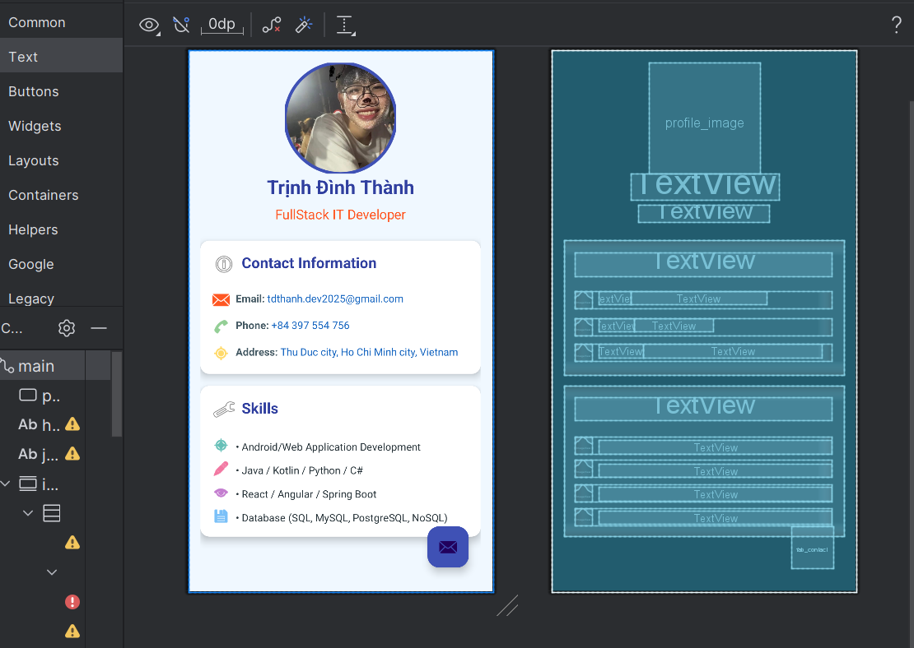

# ProfileUI_MobileDev_W1

## Thông tin sinh viên
- **Họ và tên:** Trịnh Đình Thành
- **Lớp:** CN22E
- **MSSV:** 2251120247
- **Email:** tdthanh.dev2025@gmail.com
- **SĐT:** 0397554756
- **Trường:** UTH - Đại Học GTVT Tp HCM

## Giới thiệu ứng dụng
Đây là ứng dụng Android đơn giản hiển thị thông tin cá nhân với giao diện thân thiện và hiện đại.

## Chức năng
- Hiển thị ảnh đại diện trong khung hình tròn
- Hiển thị thông tin cá nhân (tên, nghề nghiệp)
- Hiển thị thông tin liên hệ (email, số điện thoại, địa chỉ)
- Hiển thị các kỹ năng chuyên môn
- Giao diện người dùng thân thiện với các card view và màu sắc hấp dẫn

## Giao diện

## Công nghệ sử dụng
- Android Studio
- XML cho thiết kế giao diện
- ConstraintLayout để xây dựng bố cục linh hoạt
- CardView để tạo các thẻ thông tin
- Material Design cho các thành phần giao diện người dùng

## Cài đặt
1. Clone repository này về máy
2. Mở dự án trong Android Studio
3. Chạy ứng dụng trên thiết bị thật hoặc máy ảo

## Phiên bản
- Version 1.0 (Tuần 1)
