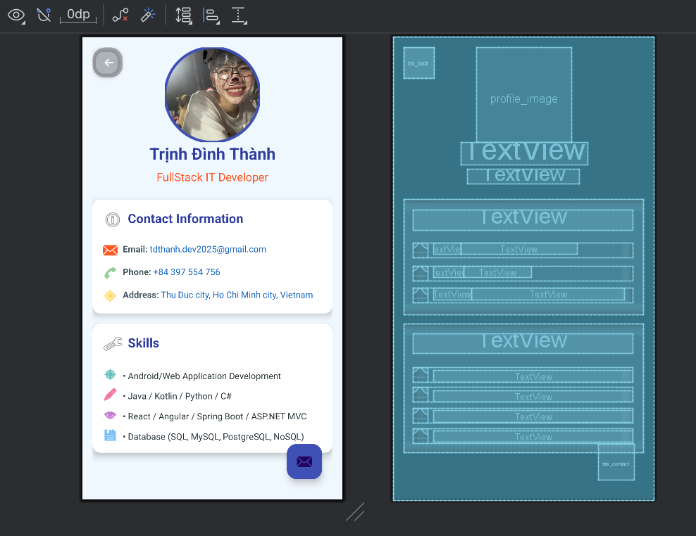

# ProfileUI_MobileDev_W1

## Thông tin sinh viên
- **Họ và tên:** Trịnh Đình Thành
- **Lớp:** CN22E
- **MSSV:** 2251120247
- **Email:** tdthanh.dev2025@gmail.com
- **SĐT:** 0397554756
- **Trường:** UTH - Đại Học GTVT Tp HCM

## Câu hỏi và trả lời

### Câu 1: Mong muốn và định hướng sau khi học xong môn học
**Mong muốn:**
- Sau khi học xong môn lập trình thiết bị di động, em mong muốn có thể tự mình lập trình, phát triển các ứng dụng hoàn chỉnh và chuyên nghiệp.

**Định hướng:**
- Hiện tại em đang tập trung trở thành Full Stack Developer
- Em đã tự học và tìm hiểu các công nghệ như Spring Boot, ASP.NET MVC, ReactJS, AngularJS
- Em đang tìm kiếm cơ hội thực tập hoặc việc làm để có thể tích lũy kinh nghiệm thực tế

### Câu 2: Lập trình di động trong 10 năm tới
Theo em, không chỉ trong 10 năm tới mà còn lâu dài hơn nữa, lập trình thiết bị di động vẫn sẽ phát triển mạnh mẽ. Đặc biệt dựa vào mức độ nhu cầu sử dụng của người dùng càng tăng tuyến tính.

**Lý do lập trình di động sẽ phát triển mạnh:**
- **Sự phổ biến của thiết bị di động:** Số lượng người dùng smartphone và các thiết bị di động khác ngày càng tăng, trở thành thiết bị công nghệ thiết yếu trong cuộc sống.
- **Phát triển công nghệ mạng:** Với sự xuất hiện của 5G và trong tương lai là 6G, tốc độ truyền dữ liệu nhanh hơn sẽ mở ra nhiều khả năng mới cho ứng dụng di động.
- **Thực tế ảo (AR) và thực tế tăng cường (VR):** Các công nghệ này đang được tích hợp ngày càng nhiều vào thiết bị di động, mở ra cơ hội phát triển ứng dụng mới.
- **Internet vạn vật (IoT):** Điện thoại di động sẽ là trung tâm điều khiển cho hệ sinh thái thiết bị IoT ngày càng phát triển.
- **Trí tuệ nhân tạo trên thiết bị di động:** AI trên thiết bị di động sẽ tạo ra trải nghiệm người dùng thông minh và cá nhân hóa hơn.

**Xu hướng trong phát triển ứng dụng di động:**
- Ứng dụng đa nền tảng sẽ phổ biến hơn với các framework như Flutter, React Native
- Ứng dụng không cần cài đặt (PWA - Progressive Web Apps) sẽ phát triển
- Tích hợp AI và Machine Learning sẽ trở thành tiêu chuẩn
- Bảo mật và quyền riêng tư sẽ được chú trọng hơn

## Giới thiệu ứng dụng
Đây là ứng dụng Android đơn giản hiển thị thông tin cá nhân với giao diện thân thiện và hiện đại.

## Chức năng
- Hiển thị ảnh đại diện trong khung hình tròn
- Hiển thị thông tin cá nhân (tên, nghề nghiệp)
- Hiển thị thông tin liên hệ (email, số điện thoại, địa chỉ)
- Hiển thị các kỹ năng chuyên môn
- Giao diện người dùng thân thiện với các card view và màu sắc hấp dẫn

## Giao diện

## Công nghệ sử dụng
- Android Studio
- XML cho thiết kế giao diện
- ConstraintLayout để xây dựng bố cục linh hoạt
- CardView để tạo các thẻ thông tin
- Material Design cho các thành phần giao diện người dùng

## Cài đặt
1. Clone repository này về máy
2. Mở dự án trong Android Studio
3. Chạy ứng dụng trên thiết bị thật hoặc máy ảo

## Phiên bản
- Version 1.0 (Tuần 1)
